# 穿书引擎 · 产品说明书

> **读完意难平？穿进去玩。**
> 把知乎盐言故事一键变成可"穿"进去的互动世界——确定性规则引擎守住命运，AI 只负责把角色演活。

**体验入口**：<https://chuanshu-engine.xyz>（支持「演示登录」快速体验）
**赛道**：知乎黑客松 2026 · 跨次元游乐场（AI 游戏与互动叙事）

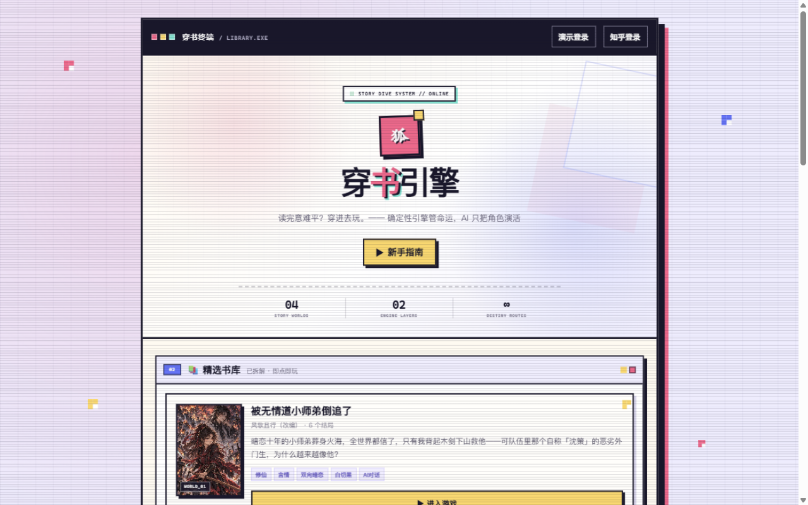

---

## 一、为什么做这个

每一个读完盐言故事的人，都经历过同一种情绪：**意难平**。要是能穿进故事里，救下那个角色、改写那个结局呢？传统同人创作门槛太高，而市面上的 AI 文字游戏普遍有四个死穴：

| AI 文字游戏的死穴 | 穿书引擎的答案 |
| --- | --- |
| AI 失忆，聊几句就忘了设定 | 世界书关键词注入 + 记忆系统，铁律永远在上下文里 |
| 人设崩塌，角色说着 OOC 的话 | 角色卡（锚点/心声/语气）注入 + 输出白名单净化 |
| 行动没有反馈，说什么都"好的" | 数值引擎实时结算：每句话都可能改变心动/真相/偏离度 |
| 永远没有结局，无限闲聊 | 剧情图谱 + 结局闸门：每局必然走向 6~11 种结局之一 |

核心思路一句话：**graph 是骨架，AI 是血肉**。命运节点由确定性引擎零 token 判定，AI 只在自由行动区间演戏——玩得越自由，AI 越鲜活；走到命运岔口，规则说了算。

---

## 二、四步穿进一本书

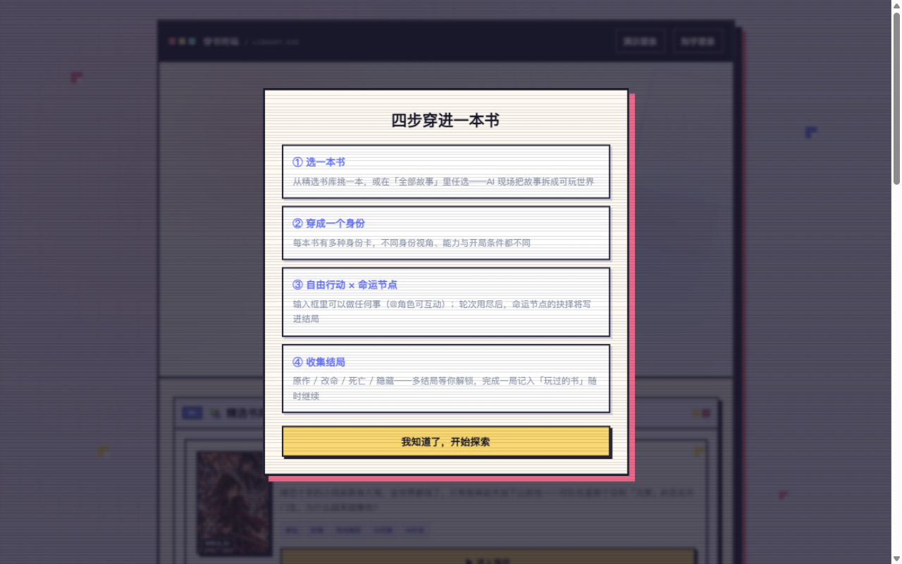

### 第 1 步 · 选一本书

精选书库 4 部已拆解完成、即点即玩的作品：修仙言情《被无情道小师弟倒追了》、高概念爽文《我在修真界掏出了 AK47》、原著长跑《凡人修仙传·凡人风起》（500+ 场景）、校园悬疑《不提分就出不去的房间》。

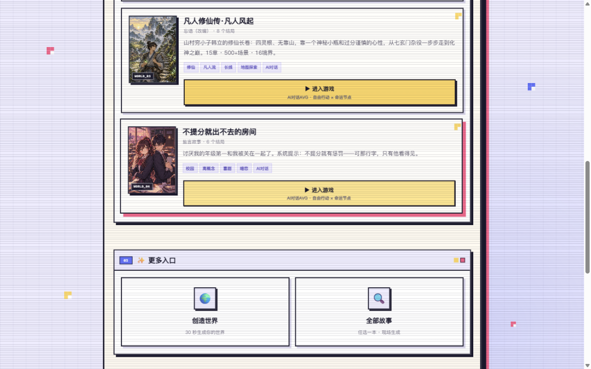

不满足于精选？「全部故事」页提供 20 部知乎盐言故事，任选一本由 AI 现场拆解成可玩世界（约 3-6 分钟）：

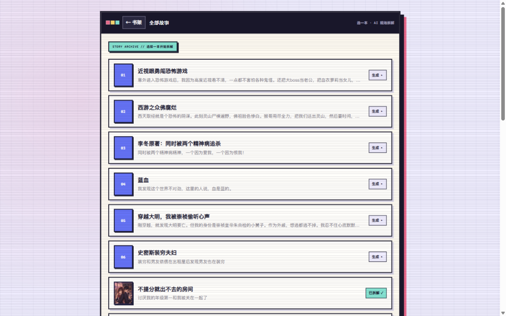

### 第 2 步 · 穿成一个身份

每本书有多种身份卡，不同身份 = 不同视角、不同能力、不同开局：穿成原作主角靠直觉莽，穿成"反派"知道全部真相但步步惊心，还有高难度的局外观棋者。**同一本书，换身份就是换一个故事。**

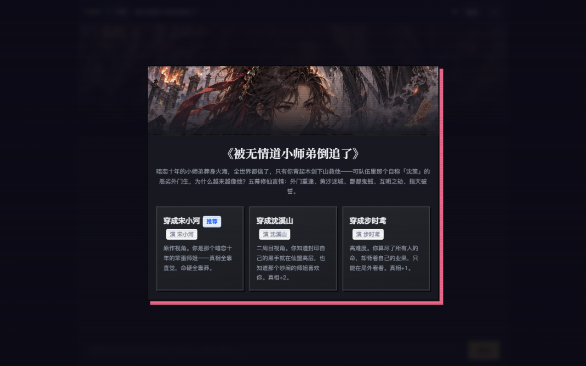

### 第 3 步 · 读你的序章

序章讲清楚三件事：这是一个什么世界、发生在你身上的事、没人告诉你的事——最后一栏就是你的"金手指"与暗线。

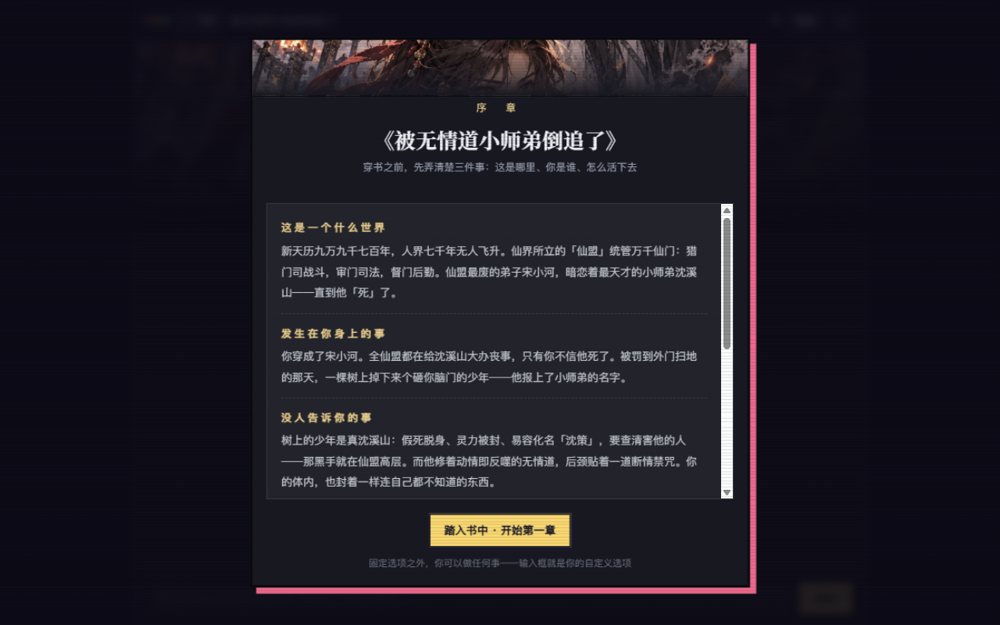

### 第 4 步 · 自由行动，收集结局

进入章节后就是 IM 式对话：你可以对任何角色说任何话、做任何事（`@角色` 精准喊话），AI 实时演出后果；也可以「推进剧情」沿原作主线前进。轮次用尽时抵达命运节点，抉择写进结局。

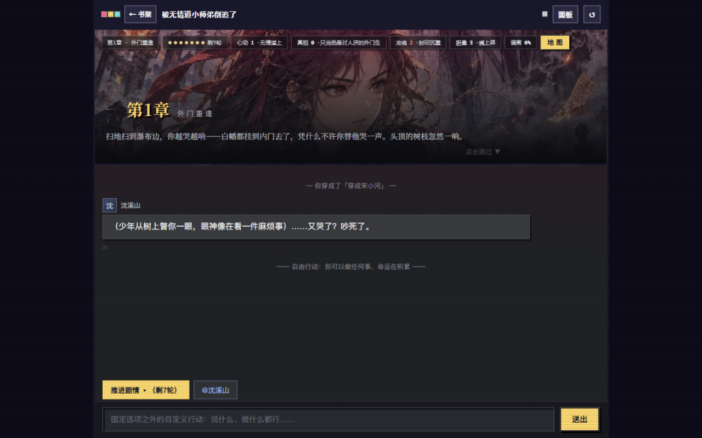

---

## 三、玩起来是什么样

### 自由行动：AI 实时演出后果

你的一句"我知道你没死"，换来的是：角色嘴硬否认的台词、80 字旁白演出的直接后果（树下少年挑眉落地、易容错认）、属性实时变化（胆量 +1、偏离度 2%）、系统给出的三个行动建议——以及一张突袭的意外事件卡。**每一次发言都有回应、都有代价。**

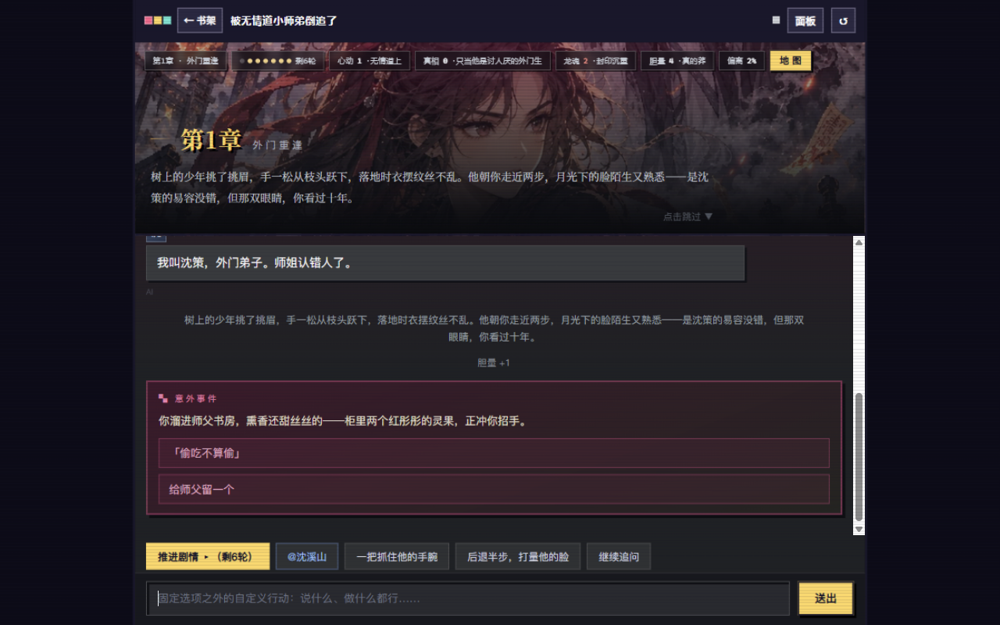

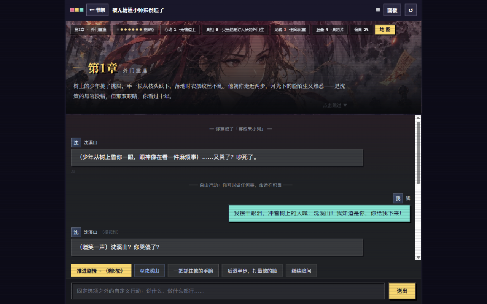

### 心声信息差：听见角色的口是心非

角色台词在明，**心声在暗**。傲娇角色嘴上说"吵死了"，心声可能是"她竟敢当众质问我"。心声不是人人可听：有的书要穿成"系统"才能全知，有的书修为达到元婴才能神识感应，有的书全程无声——**信息差本身就是玩法**。

### 地图探索：走过的路成为记忆

每张地图按章节解锁，点击前往即可探索（零 token，不花 AI 额度），线索写进你的记忆与手记。

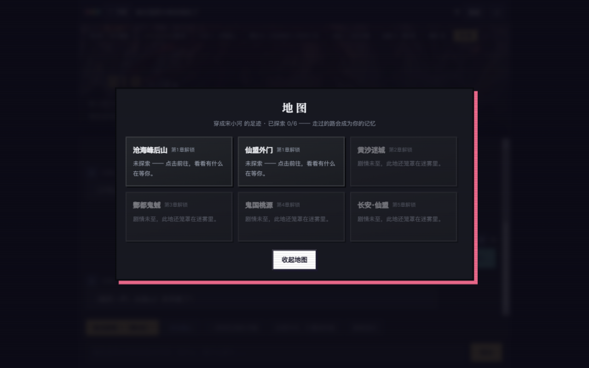

### 结局图鉴：原作线 / 改命线 / 死亡线 / 隐藏线

每本书 6~11 种结局。结局图鉴按书收集：已解锁的可以看完整命运 epilogue，未解锁的只显示线路提示——防剧透，也给你"换身份再穿一次"的理由。

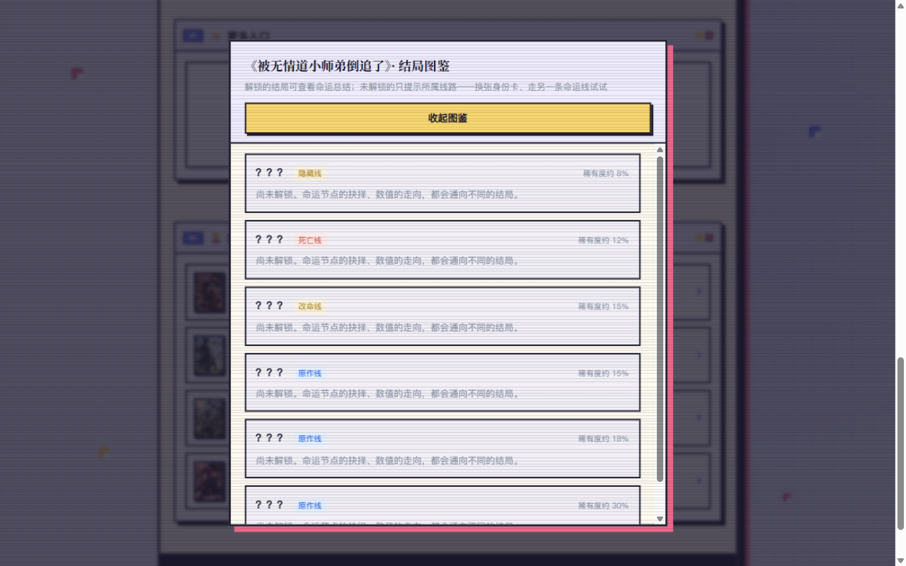

### 创造世界：30 秒，你的设定变成游戏

选类型、贴设定（一句话到 5 万字长篇都可以）、传一张封面——AI 现场把你的原创世界观拆成可玩世界，自动起书名、生成身份卡与结局。**读者秒变创作者。**

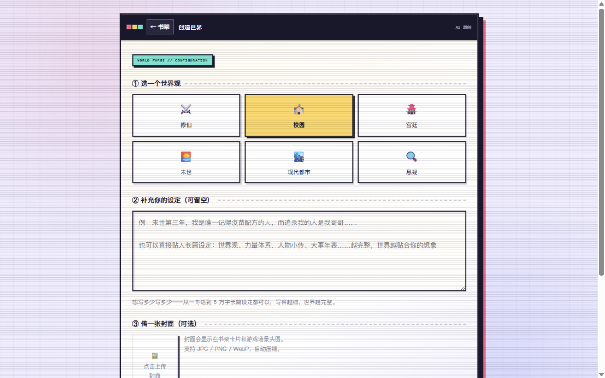

---

## 四、底层设计：AI 场景价值与创新

### 双引擎架构（本项目最核心的创新）

- **确定性规则引擎（零 token）**：剧情图谱、属性结算、事件抽取、结局闸门、地图解锁全部是纯函数——快、免费、可校验、永不背叛设定。
- **AI 叙事层（deepseek-v4-flash）**：只负责自由区间的台词、旁白、心声与后果演出，输出经白名单净化（角色 id 校验、属性 ±2 限幅、长度截断），**AI 无法改写命运，只能把命运演活**。
- 降级链：主模型 → 备用模型 → 本地预置文案，任何情况下可玩。

### 拆书管线 S1-S6：小说 → 游戏的流水线

大纲分章 → 铁律提取 → 角色卡与身份卡 → 剧情图谱 → 事件池 → 结局矩阵，六阶段各一次 AI 调用；每阶段带"确定性保底"——LLM 输出抽风（空数组/换键名/截断）时自动合成兜底内容，**任何情况下绝不产出进不去的废书**。

### 为评委与用户做的合规与安全

- 全站 AI 生成内容显著标识；页面明示"内容由 AI 生成 · 仅供比赛演示"
- 存档属主校验（防越权读写他人存档）、匿名存档 24h 滚动过期 + 每小时定时清理、登录后游客数据自动迁移转永久
- 服务端出站请求 SSRF 白名单守卫；OAuth Token 仅存服务端，浏览器只持 HttpOnly Cookie
- 知乎 OAuth 真实授权 + 演示登录双通道，方便评审快速体验

---

## 五、体验信息

| 项目 | 说明 |
| --- | --- |
| 地址 | <https://chuanshu-engine.xyz> |
| 登录 | 「演示登录」一键体验；「知乎登录」真实 OAuth |
| 单局时长 | 自由行动 5-10 分钟抵达首个命运节点，一本书 20-40 分钟通关一条线 |
| 内容量 | 精选 4 本书 31 个结局 + 20 部故事现场拆解 + 无限原创世界 |
| 技术 | 零构建前端 ES Modules + Cloudflare Workers/D1/KV + AI 叙事降级链 |

> 穿书引擎：**AI 负责表达，规则引擎守住命运。**
